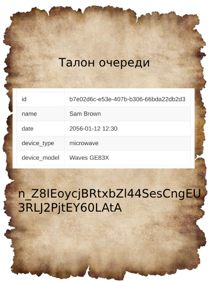

# JWT

Структура: 
+ [Что такое JWT](#что-такое-jwt)
+ [Структура JWT](#структура-jwt)
+ [Какую проблему решил JWT](#какую-проблему-решил-jwt)

## Что такое JWT

> **JSON Web Token (JWT)** — это открытый стандарт [(RFC 7519)](https://datatracker.ietf.org/doc/html/rfc7519) для 
создания токенов доступа, основанный на формате JSON. Как правило, используется для передачи данных для аутентификации 
в клиент-серверных приложениях. Токены создаются сервером, подписываются секретным ключом и передаются клиенту, который 
в дальнейшем использует данный токен для подтверждения подлинности аккаунта.

Да, понятнее не стало. JWT токен это способ подтвердить свою личность. А теперь давайте рассмотрим пример из жизни.

Итак, ситуация - у Вас сломалась микроволновка и Вы обратились в гарантийный сервис. Менеджер сказала, что печь 
посмотрят, только чуть-чуть позже, т.к. сейчас у них все мастера занятые и дали талончик на очередь.



Теперь остаётся просто прийти в сервис в назначенное время и получить тех. обслуживание. 
Но подождите-ка, там написана ближайшая дата 2056 год?!


### Почему JWT токен безопасный?
Да уж, до 2056 года не хочется ждать... Может, можно как-то немного изменить дату, чтобы быстрее получить обслуживание? 
Но как? Вся загвоздка в наборе символов внизу талона - это называется подпись (signature). Она высчитывается 
следующим образом: нужно взять все данные из талона (имя, дату и т.д.), придумать секретный ключ и передать в 
хеш-функцию (это такая функция, которая шифрует исходный текст с помощью ключа в каждый раз одинаковый набор символов,
но, если изменить хоть один символ - мы получим совершенно другой хеш).

Получается, не зная секретного ключа, мы никак не сможем подделать данные, т.к. подпись будет совершенно другой.


## Структура JWT
JWT состоит из 3 частей - header, payload и signature.

+ **Header** - это JSON, в котором содержится информация о том, как валидировать JWT токен.
+ **Payload** - это JSON, в котором содержится информация о пользователе.
+ **Signature** - это хеш-значение, которое используется для проверки JWT токена на подлинность.

Для того, чтобы передать токен по сети, нам нужно закодировать все три части по `base64` и соединить их через точку:

`header`.`payload`.`signature`

Вы можете легко сами поиграться с JWT используя [их сайт](https://jwt.io/), или мой [любимы редактор JWT.](https://dinochiesa.github.io/jwt/)


### Header
Header нужен, чтобы сервер понял, как проверить токен. В нем содержатся тип токена("typ") и алгоритм шифрования
сигнатуры ("alg").

```json
{
  "alg": "HS256",
  "typ": "JWT"
}
```

### Payload
"Полезная нагрузка" это JSON, который хранит данные пользователя для аутентификации сервером. Параметры JSON в payload'e
называются `claim`. Вы можете создать свои собственные клеймы, а можете использовать уже существующие, которые определены
в стандарте [JWT](https://datatracker.ietf.org/doc/html/rfc7519#section-4).

+ **iss (Issuer)** - тот, кто изготовил токен. Имеет вид ссылки.
+ **sub (Subject)** - тот, кто делает запрос на сервер.
+ **aud (Audience)** - ссылка на сервер, который может обработать токен (i.e. www.myfunwebapp.com).
+ **exp (Expiration Time)** - время, когда токен перестанет действовать. Указано в epoch millis.
+ **nbf (Not Before)** - время, до которого токен нельзя использовать. Точка времени в будущем в epoch millis.
+ **iat (Issued At)** - время когда токен был выпущен. Epoch millis.
+ **jti (JWT ID)** - это id токена, которое создаёт сервер для дополнительного управления токенам.

```json
{
  "sub": "1234567890",
  "name": "John Doe",
  "iat": 1516239022,
  "exp": 2714902500
}
```

### Signature
> Подпись(Signature) - это способ подтвердить, что JWT токен валидный.

Для подписи можно использовать криптографические алгоритмы, которые определенны в стандарте 
[JWA](https://datatracker.ietf.org/doc/html/rfc7518) (Json Web Algorithm)

| "alg" Param Value  | Digital Signature or MAC Algorithm             | Implementation Requirements |
|--------------------|------------------------------------------------|-----------------------------|
| HS256              | HMAC using SHA-256                             | Required                    |
| HS384              | HMAC using SHA-384                             | Optional                    |
| HS512              | HMAC using SHA-512                             | Optional                    |
| RS256              | RSASSA-PKCS1-v1_5 using SHA-256                | Recommended                 |
| RS384              | RSASSA-PKCS1-v1_5 using SHA-384                | Optional                    |
| RS512              | RSASSA-PKCS1-v1_5 using SHA-512                | Optional                    |
| ES256              | ECDSA using P-256 and SHA-256                  | Recommended                 |
| ES384              | ECDSA using P-384 and SHA-384                  | Optional                    |
| ES512              | ECDSA using P-521 and SHA-512                  | Optional                    |
| PS256              | RSASSA-PSS using SHA-256 and MGF1 with SHA-256 | Optional                    |
| PS384              | RSASSA-PSS using SHA-384 and MGF1 with SHA-384 | Optional                    |
| PS512              | RSASSA-PSS using SHA-512 and MGF1 with SHA-512 | Optional                    |
| none               | No digital signature or MAC performed          | Optional                    |

В сегодняшнем примере, мы будем использовать HS256. В формуле ниже можно увидеть каким образом создаётся подпись.
```
HMACSHA256(base64UrlEncode(header) + "." + base64UrlEncode(payload), 256bit-secret)
```
Давайте расмотрим по этапам:
1. `base64UrlEncode(header) + "." + base64UrlEncode(payload)` - кодируем header и payload по base64 и полученные 
значения соединяем через точку.

    base64 - это таблица кодировки, по этой таблице мы можем преобразовать байты в символы.
2. `256bit-secret` - это наш секретный ключ, он нужен для зашифрования текста (из пункта `1`).
3. `HMACSHA256(...)` - это уже сама функция, которая шифрует текст из пункта `1` с помощью ключа из пункта `2`
    используя алгоритм `HS256`.

То, что вернула функция и есть подпись. Для подписания токена нам нужно закодировать результат функции 
в формате base64 и добавить его в конец токена:

`header.payload.signature`

$\color{#fb015b}{eyJhbGciOiJIUzI1NiIsInR5cCI6IkpXVCJ9}$

**.**

$\color{#d63aff}{eyJzdWIiOiIxMjM0NTY3ODkwIiwibmFtZSI6IkpvaG4gRG9lIiwiaWF0IjoxNTE2MjM5MDIyfQ}$

**.**

$\color{#00b9f1}{SflKxwRJSMeKKF2QT4fwpMeJf36POk6yJV_adQssw5c}$

raw:
`eyJhbGciOiJIUzI1NiIsInR5cCI6IkpXVCJ9`.`eyJzdWIiOiIxMjM0NTY3ODkwIiwibmFtZSI6IkpvaG4gRG9lIiwiaWF0IjoxNTE2MjM5MDIyfQ`.`SflKxwRJSMeKKF2QT4fwpMeJf36POk6yJV_adQssw5c`

Именно в таком виде JWT передаётся по сети.

### Как проверить подлинность JWT

1. Вычисляем сигнатуру из токена.
2. Сравниваем с текущей. Если обе совпали - токен валидный.


## Какую проблему решил JWT

Медленная обработка запросов из-за обращения в базу данных.

Если бы сервер после успешной авторизации выдавал sessionId (случайный набор символов, который сам по себе 
не имеет смысла), то при каждом запросе пользователя проверялся бы этот sessionId с использованием базы данных.
А после того как мы проверили sessionId, нам ещё и потребуется дополнительная информация, что влечёт за 
собой ещё большее количество обращений в базу данных. Процесс извлечения данных из базы данных очень медленный
неговоря уже и о том, что у нас 10000 пользователей, которые одновременно делают запросы на сервер.

